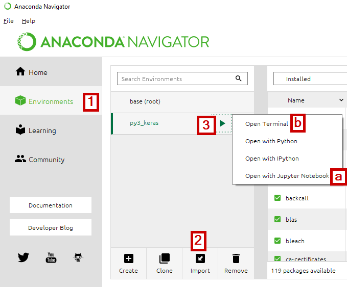

# 2019SummerSchool
Material on deep learning for the 2019 Summer School at Offenburg university

## Environment Setup

- Install Anaconda ([Python 3.7 version](https://www.anaconda.com/distribution/))

1. Open Anaconda Navigator and switch to "Environments"
2. Import the prepared environment by a specification file, select ``py3_keras.yml`` - wait until the setup is done (ONLY CPU version of Tensorflow).   
3. Use the "Play" button to start a Jupyter Notebook server in two different ways.
   a) Starts the Jupyter Server directly in the home directory of the current user. The user cannot open a different drive.
   b) Opens a terminal/console, the user can navigate to the project location and start a jupyter notebook server with ``jupyter notebook`` in that directory. 
   

